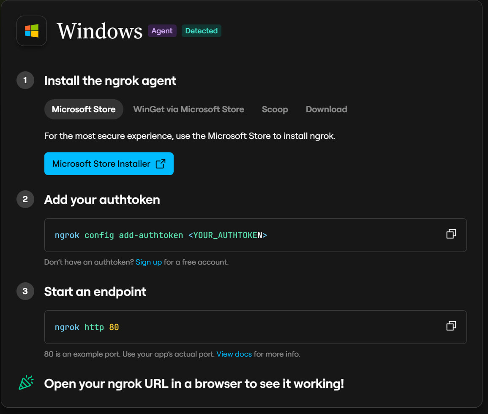
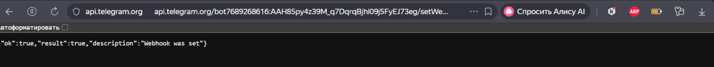
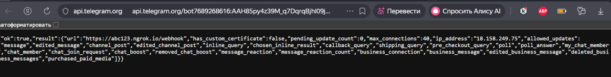
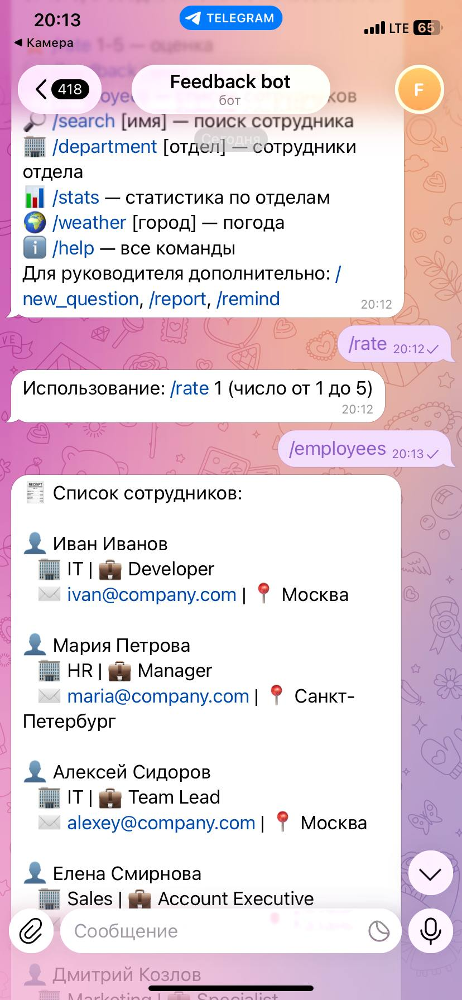
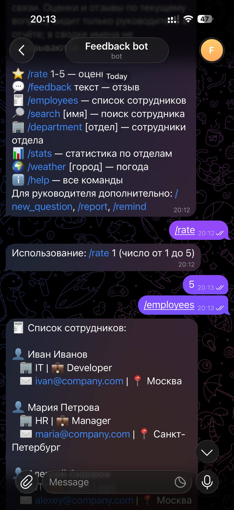
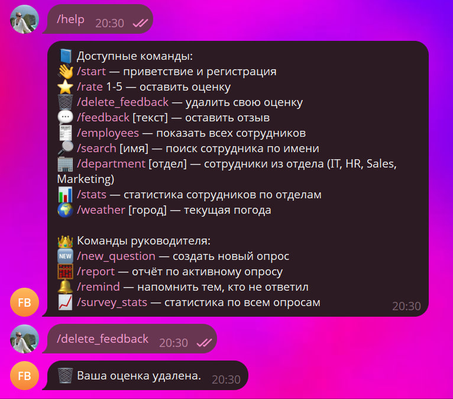

# Лабораторная работа №3
## «Запуск бота для реального использования»

---

| Поле | Значение |
|---|---|
| **University** | [ITMO University](https://itmo.ru/ru/) |
| **Faculty** | [FTMI](https://ftmi.itmo.ru/) |
| **Course** | [Vibe Coding: AI-боты для бизнеса](https://github.com/itmo-ict-faculty/vibe-coding-for-business) |
| **Year** | 2025/2026 |
| **Group** | U4125 |
| **Author** | Мажукина Ирина |
| **Lab** | Lab1 |
| **Date of create** | 09.04.2026 |
| **Date of finished** | 09.04.2026 |

---

## Запуск бота для реального использования

---

## Описание

В этой лабораторной работе я развернула своего бота так, чтобы им могли пользоваться реальные люди - ваши коллеги, друзья или команда. 

---

## Цель работы

Научиться деплоить бота и собирать обратную связь от реальных пользователей для улучшения продукта.

---

## Ход работы

### 1. Выбор способа деплоя

Мною были самый легкий вариант деплоя - вариант 1:
1. Локальный запуск с ngrok (самый простой) - Запуск на своем компьютере - Использование ngrok для доступа из интернета - Подходит для краткосрочного тестирования - Бесплатно, но требует постоянно включенный компьютер

### 2. Подготовка к деплою.

Создала файл .gitignore, файл requirements.txt остался с прошлых лаб. Также добавила логирование в bot.py (с помощью команды в cursor). 

### 3. Деплой

Зарегистрировалась в ngrok, получила токен. Установила по инструкции на сайте.


Запустила бота через python.by и не отключала терминал.

Затем натроила webhook в телеграме, проверила, что он настроен.



### 4. Тестирование деплоя

При деплое возникла проблема: python-telegram-bot несовместим с Python 3.14. Пришлось установить Python 3.11.9 и переустановить библиотеки.
После этого все заработало.

Переслала бота друзьям получила скрины.



### 5. Фидбэк

Фидбек получила положительный. Один пользователь указал, что было бы хорошо удалять свою оценку. Вставила промпт для улучшения:

```text
                                                  
Добавь в бот команду /delete_feedback. Команда позволит пользователю удалить свою оценку.

```
Команда работает успешно.


### 4. Выводы

У меня получился рабочий бот, которым можно пользоваться в свободном доступе. Данные лабораторные позволили мне без навыков программирования запустить свонго бота. Точнее не просто запустить, но еще и иметь возможность вносить изменения и улучшения.

Ссылка на бота: https://t.me/itmoftmi_MIG_bot

